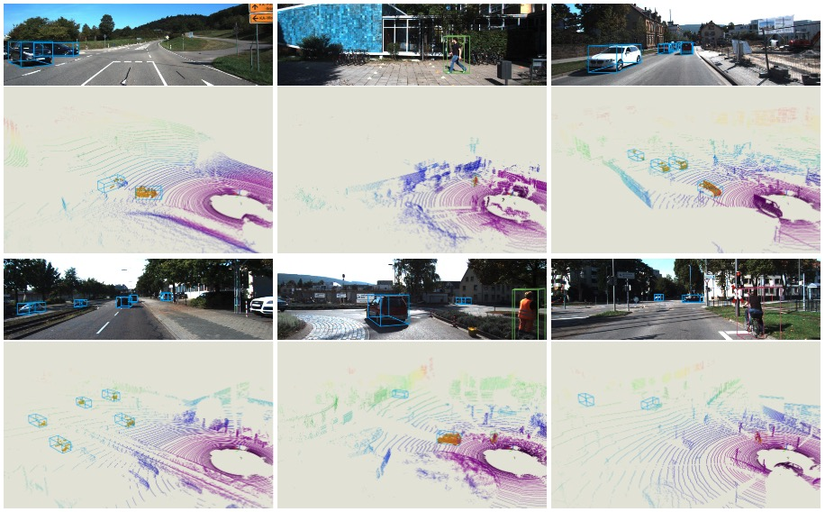

# Delving into Localization Errors for Monocular 3D Object Detection




**CODE WILL BE RELEASED BEFORE 19 June**

If you find our work useful in your research, please consider citing:

```latex
@InProceedings{Ma_2021_CVPR,
author = {Ma, Xinzhu and Zhang, Yinmin, and Xu, Dan and Zhou, Dongzhan and Yi, Shuai and Li, Haojie and Ouyang, Wanli},
title = {Delving into Localization Errors for Monocular 3D Object Detection},
booktitle = {Proceedings of the IEEE/CVF Conference on Computer Vision and Pattern Recognition (CVPR)},
month = {June},
year = {2021}}
```

